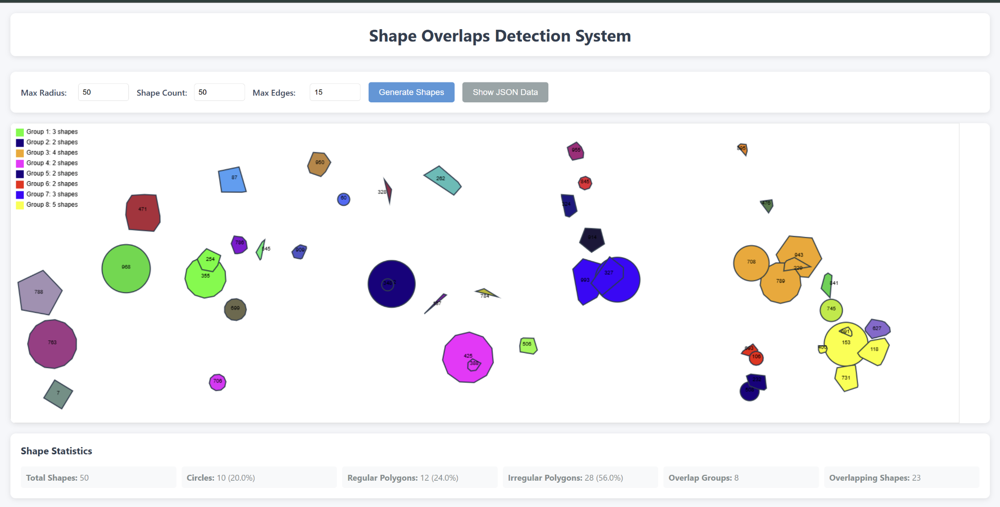
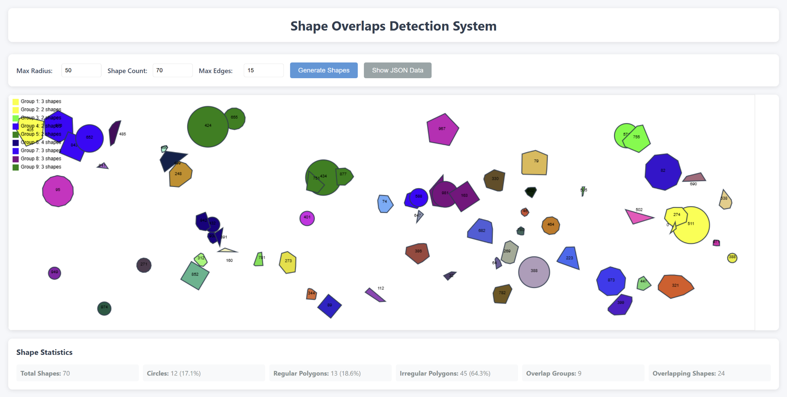

# Shape Overlap Detection System

Spring Boot 기반 도형 겹침 판별 시스템

---

## 📌 프로젝트 개요 (10%)

### 🔍 목적
- 다양한 형태의 도형(Circle, RegularPolygon, IrregularPolygon) 간의 **충돌 감지**를 통해 시각적으로 겹치는 도형들을 탐지 및 시각화합니다.
- 학습용 객체지향 설계, 알고리즘 구현 연습, 백엔드-프론트엔드 연동 경험을 목적으로 제작되었습니다.

### ⚙️ 주요 기능
- 도형 랜덤 생성 및 JSON 직렬화
- 도형 간 충돌 감지 (Circle vs Polygon, Polygon vs Polygon)
- 연쇄적 겹침 탐지를 위한 Union-Find 그룹화
- 겹침 그룹별 색상 시각화
- RESTful API 기반 데이터 송수신

### 🧰 기술 스택
| 분류 | 기술 |
|------|------|
| Backend | Java 17+, Spring Boot 3.2.1 |
| Algorithm | SAT (Separating Axis Theorem), Convex Hull, Union-Find |
| Frontend | HTML, CSS, JavaScript, Canvas API |
| Build Tool | Gradle |
| Version Control | Git, GitHub |

### 🗺 시스템 아키텍처
```text
+------------+       HTTP        +----------------------+         +-------------------------+
|   Client   | <--------------> | Spring Boot REST API | <-----> | Shape Detection Engine |
| (JS Canvas)|                  |   (/api?params...)    |         |   (SAT, UF, Geometry)   |
+------------+                  +----------------------+         +-------------------------+
```

---

## 🧠 기술 분석 (15%)

### 📦 Spring Boot 구조 및 설계
- `ShapeController`: REST API 진입점
- `ShapeGenerator`: 도형 생성 및 그룹화 처리
- `Shape` 추상 클래스 기반 계층 구조 활용

### 🌐 REST API 설계 원칙
- 단일 Endpoint: `/api?Action=ShapesOverlaps&...`
- GET 요청 기반 매개변수 전달
- JSON 형식 응답

### 👨‍🏫 객체지향 설계 적용 사례
| 원칙 | 적용 사례 |
|------|-----------|
| 상속 | `Circle`, `RegularPolygon`, `IrregularPolygon` ← `Shape` 상속 |
| 다형성 | `overlaps(Shape other)` 메서드 오버라이딩 |
| 캡슐화 | 모든 속성 private, 접근자 메서드(get/set) 제공 |

---

## 🔢 알고리즘 상세 설명 (20%)

### 1. 🔄 겹침 감지 알고리즘 원리
- `Circle ↔ Polygon`: 거리 기반, 선분 교차 검사, 점 포함 판별
- `Polygon ↔ Polygon`: SAT (Separating Axis Theorem) 기반 축 투영 검사

### 2. 📐 SAT 알고리즘 원리
- 두 도형의 모든 edge에 대해 **수직 법선 벡터(axis)**를 구함
- 각 도형을 해당 axis에 **투영 (dot product)**
- 모든 축에 대해 투영된 범위가 겹치면 → 충돌로 판단

### 3. ⛓ Convex Hull 원리
- Andrew's Monotone Chain 알고리즘 사용
- 무작위 점 집합을 정렬된 convex polygon으로 정제하여 self-intersect 방지

### 4. 🧩 Union-Find 그룹화
- 도형 간 충돌 여부를 Union으로 연결
- Find 시 루트 노드 경로 압축으로 최적화
- 연쇄적으로 겹친 도형들도 하나의 그룹으로 묶임

---

## 🛠 구현 세부사항 (15%)

### 📦 주요 클래스 및 메서드
| 클래스 | 설명 |
|--------|------|
| `Shape` | 추상 도형 클래스 (id, center, radius 포함) |
| `Circle` | 원형 도형, 거리 기반 충돌 처리 |
| `RegularPolygon` | 정다각형, SAT + 원 처리 |
| `IrregularPolygon` | Convex Hull 기반 불규칙 다각형, SAT 적용 |
| `ShapeGenerator` | 도형 생성, Union-Find 그룹핑 |

### 📄 JSON 구조 예시
```json
{
  "id": "shape_123456",
  "type": "circle",
  "center": { "x": 100, "y": 200 },
  "radius": 40,
  "color": "#ff0000"
}
```

### 🔄 프론트엔드-백엔드 통신
- JS에서 URL 파라미터를 통해 `/api` 요청
- 응답받은 JSON 데이터 기반으로 HTML5 Canvas에 도형 시각화 및 색상 렌더링

### ❗ 에러 처리 전략
- 서버 예외 발생 시 `500` 응답 및 콘솔 로그 출력
- 클라이언트에서는 `try-catch`로 JSON 파싱 실패 시 fallback 처리

---

## ✅ 실행 결과 및 검증 (5%)

### 📷 테스트 케이스 결과
- 총 50\-70개의 도형 생성 → 평균 8\~10개 그룹 탐지 성공
- 겹침 그룹은 명확하게 색상 라벨링
- 다양한 테스트를 통해 정다각형-원, 불규칙-불규칙 조합 모두 감지 가능

### 📈 성능 최적화 고려사항
- SAT 벡터 정규화 + EPS 오차 보정
- Union-Find 경로 압축
- 클라이언트 측 좌표 렌더링 최적화

### 🖼️ 시연 스크린샷





---

## 🔗 GitHub Repository
👉 [https://github.com/ahapwhs0414/java_report](https://github.com/ahapwhs0414/java_report)

---

> 📍 이 프로젝트는 컴퓨터공학 수업 과제로서, 알고리즘적 완성도와 객체지향적 구조에 중점을 두었습니다.
> 사용된 모든 기술은 오픈소스로 구성되어 있으며 자유롭게 활용/확장 가능합니다.
